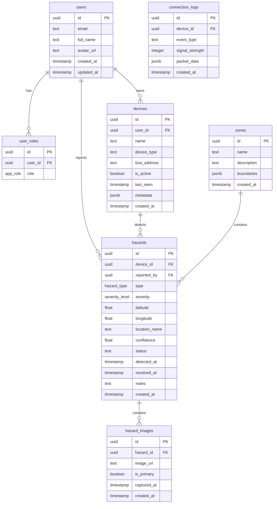

# Hazard Detection System - Database Schema

## Overview

This document describes the PostgreSQL database schema for the IoT + AI pothole and road-crack detection system.

---

## Entity Relationship Diagram



---

## Enums

```sql
-- Hazard type enum
CREATE TYPE public.hazard_type AS ENUM ('pothole', 'crack', 'debris', 'flooding');

-- Severity level enum
CREATE TYPE public.severity_level AS ENUM ('low', 'medium', 'high', 'critical');

-- Hazard status enum
CREATE TYPE public.hazard_status AS ENUM ('detected', 'confirmed', 'in_progress', 'resolved', 'false_positive');

-- User role enum
CREATE TYPE public.app_role AS ENUM ('admin', 'operator', 'viewer');

-- Device type enum
CREATE TYPE public.device_type AS ENUM ('drone', 'vehicle', 'fixed_station');

-- Connection event type enum
CREATE TYPE public.connection_event AS ENUM ('connected', 'disconnected', 'packet_received', 'error');
```

---

## Tables

### 1. Profiles Table

```sql
CREATE TABLE public.profiles (
    id UUID PRIMARY KEY REFERENCES auth.users(id) ON DELETE CASCADE,
    email TEXT,
    full_name TEXT,
    avatar_url TEXT,
    created_at TIMESTAMP WITH TIME ZONE DEFAULT NOW(),
    updated_at TIMESTAMP WITH TIME ZONE DEFAULT NOW()
);

-- Enable RLS
ALTER TABLE public.profiles ENABLE ROW LEVEL SECURITY;

-- Policies
CREATE POLICY "Users can view own profile"
ON public.profiles FOR SELECT
TO authenticated
USING (auth.uid() = id);

CREATE POLICY "Users can update own profile"
ON public.profiles FOR UPDATE
TO authenticated
USING (auth.uid() = id);

-- Trigger to create profile on signup
CREATE OR REPLACE FUNCTION public.handle_new_user()
RETURNS TRIGGER
LANGUAGE plpgsql
SECURITY DEFINER
SET search_path = public
AS $$
BEGIN
    INSERT INTO public.profiles (id, email, full_name)
    VALUES (
        NEW.id,
        NEW.email,
        COALESCE(NEW.raw_user_meta_data->>'full_name', '')
    );
    RETURN NEW;
END;
$$;

CREATE TRIGGER on_auth_user_created
    AFTER INSERT ON auth.users
    FOR EACH ROW EXECUTE FUNCTION public.handle_new_user();
```

### 2. User Roles Table

```sql
CREATE TABLE public.user_roles (
    id UUID PRIMARY KEY DEFAULT gen_random_uuid(),
    user_id UUID REFERENCES auth.users(id) ON DELETE CASCADE NOT NULL,
    role app_role NOT NULL DEFAULT 'viewer',
    created_at TIMESTAMP WITH TIME ZONE DEFAULT NOW(),
    UNIQUE (user_id, role)
);

-- Enable RLS
ALTER TABLE public.user_roles ENABLE ROW LEVEL SECURITY;

-- Security definer function to check roles (prevents RLS recursion)
CREATE OR REPLACE FUNCTION public.has_role(_user_id UUID, _role app_role)
RETURNS BOOLEAN
LANGUAGE sql
STABLE
SECURITY DEFINER
SET search_path = public
AS $$
    SELECT EXISTS (
        SELECT 1
        FROM public.user_roles
        WHERE user_id = _user_id
          AND role = _role
    )
$$;

-- Policies
CREATE POLICY "Users can view own roles"
ON public.user_roles FOR SELECT
TO authenticated
USING (auth.uid() = user_id);

CREATE POLICY "Admins can manage all roles"
ON public.user_roles FOR ALL
TO authenticated
USING (public.has_role(auth.uid(), 'admin'));
```

### 3. Devices Table

```sql
CREATE TABLE public.devices (
    id UUID PRIMARY KEY DEFAULT gen_random_uuid(),
    user_id UUID REFERENCES auth.users(id) ON DELETE SET NULL,
    name TEXT NOT NULL,
    device_type device_type NOT NULL DEFAULT 'vehicle',
    lora_address TEXT UNIQUE,
    is_active BOOLEAN DEFAULT true,
    last_seen TIMESTAMP WITH TIME ZONE,
    signal_strength INTEGER DEFAULT 0,
    metadata JSONB DEFAULT '{}',
    created_at TIMESTAMP WITH TIME ZONE DEFAULT NOW(),
    updated_at TIMESTAMP WITH TIME ZONE DEFAULT NOW()
);

-- Enable RLS
ALTER TABLE public.devices ENABLE ROW LEVEL SECURITY;

-- Indexes
CREATE INDEX idx_devices_user_id ON public.devices(user_id);
CREATE INDEX idx_devices_lora_address ON public.devices(lora_address);
CREATE INDEX idx_devices_is_active ON public.devices(is_active);

-- Policies
CREATE POLICY "Authenticated users can view devices"
ON public.devices FOR SELECT
TO authenticated
USING (true);

CREATE POLICY "Operators can manage devices"
ON public.devices FOR ALL
TO authenticated
USING (
    public.has_role(auth.uid(), 'admin') OR 
    public.has_role(auth.uid(), 'operator')
);
```

### 4. Zones Table

```sql
CREATE TABLE public.zones (
    id UUID PRIMARY KEY DEFAULT gen_random_uuid(),
    name TEXT NOT NULL,
    description TEXT,
    boundaries JSONB, -- GeoJSON polygon
    center_lat FLOAT,
    center_lng FLOAT,
    radius_km FLOAT,
    created_at TIMESTAMP WITH TIME ZONE DEFAULT NOW(),
    updated_at TIMESTAMP WITH TIME ZONE DEFAULT NOW()
);

-- Enable RLS
ALTER TABLE public.zones ENABLE ROW LEVEL SECURITY;

-- Policies
CREATE POLICY "Anyone can view zones"
ON public.zones FOR SELECT
TO authenticated
USING (true);

CREATE POLICY "Admins can manage zones"
ON public.zones FOR ALL
TO authenticated
USING (public.has_role(auth.uid(), 'admin'));
```

### 5. Hazards Table (Main Detection Data)

```sql
CREATE TABLE public.hazards (
    id UUID PRIMARY KEY DEFAULT gen_random_uuid(),
    device_id UUID REFERENCES public.devices(id) ON DELETE SET NULL,
    reported_by UUID REFERENCES auth.users(id) ON DELETE SET NULL,
    zone_id UUID REFERENCES public.zones(id) ON DELETE SET NULL,
    
    -- Hazard details
    type hazard_type NOT NULL,
    severity severity_level NOT NULL DEFAULT 'medium',
    confidence FLOAT CHECK (confidence >= 0 AND confidence <= 100),
    
    -- Location
    latitude FLOAT NOT NULL,
    longitude FLOAT NOT NULL,
    location_name TEXT,
    
    -- Status tracking
    status hazard_status DEFAULT 'detected',
    
    -- Timestamps
    detected_at TIMESTAMP WITH TIME ZONE DEFAULT NOW(),
    confirmed_at TIMESTAMP WITH TIME ZONE,
    resolved_at TIMESTAMP WITH TIME ZONE,
    
    -- Additional info
    notes TEXT,
    metadata JSONB DEFAULT '{}',
    
    created_at TIMESTAMP WITH TIME ZONE DEFAULT NOW(),
    updated_at TIMESTAMP WITH TIME ZONE DEFAULT NOW()
);

-- Enable RLS
ALTER TABLE public.hazards ENABLE ROW LEVEL SECURITY;

-- Indexes for performance
CREATE INDEX idx_hazards_type ON public.hazards(type);
CREATE INDEX idx_hazards_severity ON public.hazards(severity);
CREATE INDEX idx_hazards_status ON public.hazards(status);
CREATE INDEX idx_hazards_detected_at ON public.hazards(detected_at DESC);
CREATE INDEX idx_hazards_location ON public.hazards(latitude, longitude);
CREATE INDEX idx_hazards_device_id ON public.hazards(device_id);
CREATE INDEX idx_hazards_zone_id ON public.hazards(zone_id);

-- Spatial index for location queries (if PostGIS is enabled)
-- CREATE INDEX idx_hazards_geom ON public.hazards USING GIST (
--     ST_SetSRID(ST_MakePoint(longitude, latitude), 4326)
-- );

-- Policies
CREATE POLICY "Anyone can view hazards"
ON public.hazards FOR SELECT
TO authenticated
USING (true);

CREATE POLICY "Devices and operators can insert hazards"
ON public.hazards FOR INSERT
TO authenticated
WITH CHECK (true);

CREATE POLICY "Operators can update hazards"
ON public.hazards FOR UPDATE
TO authenticated
USING (
    public.has_role(auth.uid(), 'admin') OR 
    public.has_role(auth.uid(), 'operator')
);

CREATE POLICY "Admins can delete hazards"
ON public.hazards FOR DELETE
TO authenticated
USING (public.has_role(auth.uid(), 'admin'));
```

### 6. Hazard Images Table

```sql
CREATE TABLE public.hazard_images (
    id UUID PRIMARY KEY DEFAULT gen_random_uuid(),
    hazard_id UUID REFERENCES public.hazards(id) ON DELETE CASCADE NOT NULL,
    image_url TEXT NOT NULL,
    is_primary BOOLEAN DEFAULT false,
    captured_at TIMESTAMP WITH TIME ZONE DEFAULT NOW(),
    metadata JSONB DEFAULT '{}',
    created_at TIMESTAMP WITH TIME ZONE DEFAULT NOW()
);

-- Enable RLS
ALTER TABLE public.hazard_images ENABLE ROW LEVEL SECURITY;

-- Indexes
CREATE INDEX idx_hazard_images_hazard_id ON public.hazard_images(hazard_id);

-- Policies
CREATE POLICY "Anyone can view hazard images"
ON public.hazard_images FOR SELECT
TO authenticated
USING (true);

CREATE POLICY "Operators can manage hazard images"
ON public.hazard_images FOR ALL
TO authenticated
USING (
    public.has_role(auth.uid(), 'admin') OR 
    public.has_role(auth.uid(), 'operator')
);
```

### 7. Connection Logs Table

```sql
CREATE TABLE public.connection_logs (
    id UUID PRIMARY KEY DEFAULT gen_random_uuid(),
    device_id UUID REFERENCES public.devices(id) ON DELETE CASCADE,
    event_type connection_event NOT NULL,
    signal_strength INTEGER,
    packets_received INTEGER DEFAULT 0,
    packet_data JSONB,
    error_message TEXT,
    created_at TIMESTAMP WITH TIME ZONE DEFAULT NOW()
);

-- Enable RLS
ALTER TABLE public.connection_logs ENABLE ROW LEVEL SECURITY;

-- Indexes
CREATE INDEX idx_connection_logs_device_id ON public.connection_logs(device_id);
CREATE INDEX idx_connection_logs_created_at ON public.connection_logs(created_at DESC);
CREATE INDEX idx_connection_logs_event_type ON public.connection_logs(event_type);

-- Policies
CREATE POLICY "Operators can view connection logs"
ON public.connection_logs FOR SELECT
TO authenticated
USING (
    public.has_role(auth.uid(), 'admin') OR 
    public.has_role(auth.uid(), 'operator')
);

CREATE POLICY "System can insert connection logs"
ON public.connection_logs FOR INSERT
TO authenticated
WITH CHECK (true);

-- Auto-cleanup old logs (keep 30 days)
CREATE OR REPLACE FUNCTION public.cleanup_old_connection_logs()
RETURNS void
LANGUAGE plpgsql
SECURITY DEFINER
AS $$
BEGIN
    DELETE FROM public.connection_logs
    WHERE created_at < NOW() - INTERVAL '30 days';
END;
$$;
```

---

## Utility Functions

### Get Analytics Summary

```sql
CREATE OR REPLACE FUNCTION public.get_hazard_analytics(
    _start_date TIMESTAMP WITH TIME ZONE DEFAULT NOW() - INTERVAL '7 days',
    _end_date TIMESTAMP WITH TIME ZONE DEFAULT NOW()
)
RETURNS JSON
LANGUAGE plpgsql
STABLE
SECURITY DEFINER
SET search_path = public
AS $$
DECLARE
    result JSON;
BEGIN
    SELECT json_build_object(
        'total_hazards', COUNT(*),
        'potholes', COUNT(*) FILTER (WHERE type = 'pothole'),
        'cracks', COUNT(*) FILTER (WHERE type = 'crack'),
        'high_severity', COUNT(*) FILTER (WHERE severity = 'high'),
        'medium_severity', COUNT(*) FILTER (WHERE severity = 'medium'),
        'low_severity', COUNT(*) FILTER (WHERE severity = 'low'),
        'resolved', COUNT(*) FILTER (WHERE status = 'resolved'),
        'pending', COUNT(*) FILTER (WHERE status IN ('detected', 'confirmed', 'in_progress'))
    ) INTO result
    FROM public.hazards
    WHERE detected_at BETWEEN _start_date AND _end_date;
    
    RETURN result;
END;
$$;
```

### Get Hazards by Radius

```sql
CREATE OR REPLACE FUNCTION public.get_hazards_in_radius(
    _lat FLOAT,
    _lng FLOAT,
    _radius_km FLOAT DEFAULT 5
)
RETURNS SETOF public.hazards
LANGUAGE sql
STABLE
SECURITY DEFINER
SET search_path = public
AS $$
    SELECT *
    FROM public.hazards
    WHERE (
        6371 * acos(
            cos(radians(_lat)) * cos(radians(latitude)) *
            cos(radians(longitude) - radians(_lng)) +
            sin(radians(_lat)) * sin(radians(latitude))
        )
    ) <= _radius_km
    ORDER BY detected_at DESC;
$$;
```

### Get Daily Detection Counts

```sql
CREATE OR REPLACE FUNCTION public.get_daily_detections(
    _days INTEGER DEFAULT 7
)
RETURNS TABLE(date DATE, count BIGINT)
LANGUAGE sql
STABLE
SECURITY DEFINER
SET search_path = public
AS $$
    SELECT 
        DATE(detected_at) as date,
        COUNT(*) as count
    FROM public.hazards
    WHERE detected_at >= NOW() - (_days || ' days')::INTERVAL
    GROUP BY DATE(detected_at)
    ORDER BY date ASC;
$$;
```

### Get Most Affected Zones

```sql
CREATE OR REPLACE FUNCTION public.get_affected_zones(
    _limit INTEGER DEFAULT 10
)
RETURNS TABLE(zone_name TEXT, hazard_count BIGINT)
LANGUAGE sql
STABLE
SECURITY DEFINER
SET search_path = public
AS $$
    SELECT 
        COALESCE(z.name, h.location_name, 'Unknown') as zone_name,
        COUNT(*) as hazard_count
    FROM public.hazards h
    LEFT JOIN public.zones z ON h.zone_id = z.id
    GROUP BY COALESCE(z.name, h.location_name, 'Unknown')
    ORDER BY hazard_count DESC
    LIMIT _limit;
$$;
```

---

## Storage Buckets

```sql
-- Create storage bucket for hazard images
INSERT INTO storage.buckets (id, name, public)
VALUES ('hazard-images', 'hazard-images', true);

-- Storage policies
CREATE POLICY "Anyone can view hazard images"
ON storage.objects FOR SELECT
TO authenticated
USING (bucket_id = 'hazard-images');

CREATE POLICY "Operators can upload hazard images"
ON storage.objects FOR INSERT
TO authenticated
WITH CHECK (
    bucket_id = 'hazard-images' AND
    (public.has_role(auth.uid(), 'admin') OR public.has_role(auth.uid(), 'operator'))
);

CREATE POLICY "Admins can delete hazard images"
ON storage.objects FOR DELETE
TO authenticated
USING (
    bucket_id = 'hazard-images' AND
    public.has_role(auth.uid(), 'admin')
);
```

---

## Realtime Subscriptions

Enable realtime for live updates:

```sql
-- Enable realtime for hazards table
ALTER PUBLICATION supabase_realtime ADD TABLE public.hazards;

-- Enable realtime for connection logs
ALTER PUBLICATION supabase_realtime ADD TABLE public.connection_logs;

-- Enable realtime for devices
ALTER PUBLICATION supabase_realtime ADD TABLE public.devices;
```

---

## Sample Data Insert

```sql
-- Insert sample zones
INSERT INTO public.zones (name, description, center_lat, center_lng, radius_km) VALUES
('Downtown', 'Central business district', 40.7128, -74.006, 2),
('Midtown', 'Midtown Manhattan area', 40.7549, -73.984, 2),
('Financial District', 'Wall Street area', 40.7074, -74.0113, 1.5);

-- Insert sample device
INSERT INTO public.devices (name, device_type, lora_address, is_active) VALUES
('Drone-01', 'drone', 'LORA-001-A1B2', true),
('Vehicle-01', 'vehicle', 'LORA-002-C3D4', true);
```

---

## ESP32 Data Format (Reference)

Expected JSON payload from ESP32 + LoRa:

```json
{
  "device_id": "LORA-001-A1B2",
  "type": "pothole",
  "severity": "high",
  "confidence": 94.5,
  "latitude": 40.7128,
  "longitude": -74.006,
  "image_base64": "...",
  "timestamp": "2026-01-22T10:30:00Z",
  "signal_strength": 85
}
```

---

## Quick Setup Commands

Run all SQL in order:

1. Create enums
2. Create tables (profiles → user_roles → devices → zones → hazards → hazard_images → connection_logs)
3. Create functions
4. Set up storage
5. Enable realtime
6. Insert sample data
